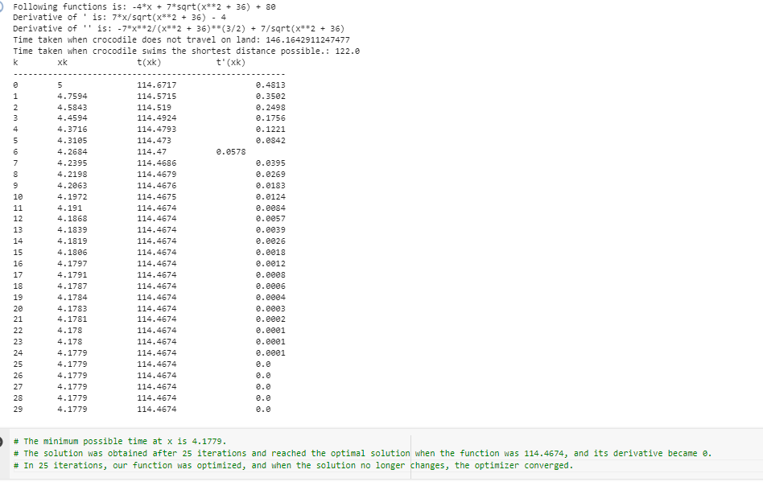
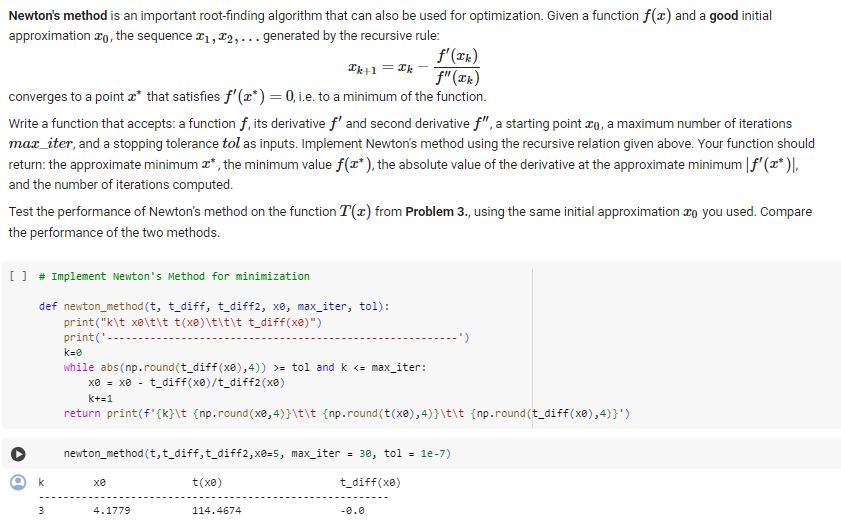
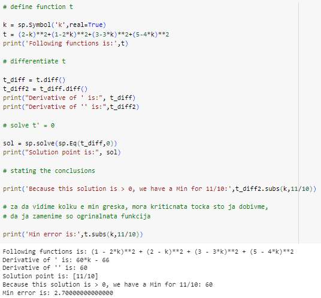

# Project Title :
Python-Math-Stats-Calculus-Project.

## Project Overview :
This project involves solving optimization problems using calculus techniques such as Gradient Descent and Newton's method. 
Additionally, it includes regression analysis to minimize the total error in a given model.

## Project Highlights :
Multidimensional Optimization: Implementing computational methods for optimizing functions in both single and multiple dimensions.

Algorithmic Comparison: Evaluating the performance of optimization algorithms such as Gradient Descent and Newton's method.

Regression Analysis: Employing regression techniques to minimize the error in the model parameter.

## Project Preview :

## Multidimensional Optimization :

## Gradient Descent and the Newton's method :

## Regression techniques to minimize the error : 

